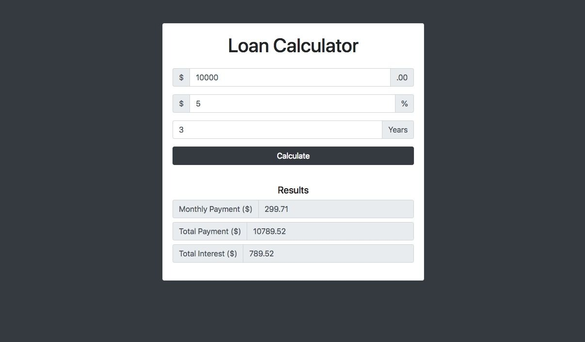

# Javascript Loan Calculator

Javascript Loan Calculator using raw Javascript & DOM.

### Features

- Mobile responsive design
- Input custom loan amount
- Input custom interest percentage
- Input custom loan return year duration
- Empty input checking and warning
- jQuery v3.3.1 support
- Twitter Bootstrap v4.2.1 support

### Screenshot

<em>Loan Calculate Homepage</em>  

<em>Loan Calculate result</em>
